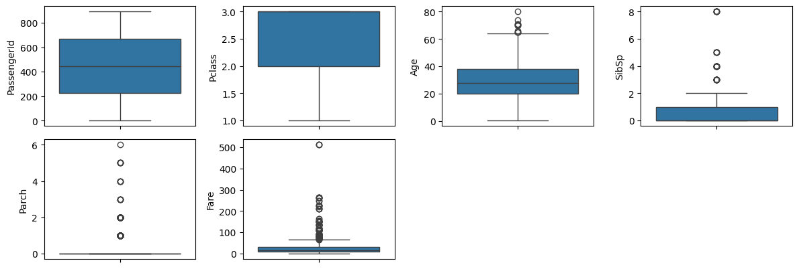

# Introduction
This notebook is a personal exploration of an end-to-end data science process and serves as a learning process for myself as I continue to pursue a career in data science. <br>

The challenge is based on the Kaggle Titanic Competition that provides a dataset with different passenger attributes together with their survival status of the shipwreck. The aim is to develop a model capable of predicting passenger survival.


## Table of Contents 
Note: I can't get links to work 😡

[1. Exploratory Data Analysis](#explore) <br>
> [1.1 Preliminary observations](#prelim_explore) <br>
   [1.2 Exploring numerical attributes](#explore_num_columns) <br>
   [1.3 Exploring categorical attributes](#explore_cat_columns)  <br>
   [1.4 Univariate Analysis](#explore_cat_columns)  <br>
   [1.5 Bivariate Analysis](#explore_cat_columns)  <br>


### Imports


```python
# Core
import pandas as pd
import numpy as np

# Data Visualisation
import matplotlib.pyplot as plt
import seaborn as sns
%matplotlib inline
```

### Reading Input


```python
# !unzip data/titanic.zip -d data/

test_data = pd.read_csv("data/test.csv")
train_data = pd.read_csv("data/train.csv")
pd.set_option("display.max_rows", None)
```

# 1. Exploratory Data Analysis
Objectives:
- Gain a preliminary understanding of available data
- Check for missing or null values
- Find potential outliers
- Assess correlations amongst attributes/features
- Check for data skew

[Back to contents](#top)

## 1.1 Preliminary observations
Examples from the dataset are shown below. <br><br>
[Back to contents](#top)


```python
print("train: ", train_data.shape)
train_data.head(5)
```

    train:  (891, 12)


<div>
<table border="1" class="dataframe">
  <thead>
    <tr style="text-align: right;">
      <th></th>
      <th>PassengerId</th>
      <th>Survived</th>
      <th>Pclass</th>
      <th>Name</th>
      <th>Sex</th>
      <th>Age</th>
      <th>SibSp</th>
      <th>Parch</th>
      <th>Ticket</th>
      <th>Fare</th>
      <th>Cabin</th>
      <th>Embarked</th>
    </tr>
  </thead>
  <tbody>
    <tr>
      <th>0</th>
      <td>1</td>
      <td>0</td>
      <td>3</td>
      <td>Braund, Mr. Owen Harris</td>
      <td>male</td>
      <td>22.0</td>
      <td>1</td>
      <td>0</td>
      <td>A/5 21171</td>
      <td>7.2500</td>
      <td>NaN</td>
      <td>S</td>
    </tr>
    <tr>
      <th>1</th>
      <td>2</td>
      <td>1</td>
      <td>1</td>
      <td>Cumings, Mrs. John Bradley (Florence Briggs Th...</td>
      <td>female</td>
      <td>38.0</td>
      <td>1</td>
      <td>0</td>
      <td>PC 17599</td>
      <td>71.2833</td>
      <td>C85</td>
      <td>C</td>
    </tr>
    <tr>
      <th>2</th>
      <td>3</td>
      <td>1</td>
      <td>3</td>
      <td>Heikkinen, Miss. Laina</td>
      <td>female</td>
      <td>26.0</td>
      <td>0</td>
      <td>0</td>
      <td>STON/O2. 3101282</td>
      <td>7.9250</td>
      <td>NaN</td>
      <td>S</td>
    </tr>
    <tr>
      <th>3</th>
      <td>4</td>
      <td>1</td>
      <td>1</td>
      <td>Futrelle, Mrs. Jacques Heath (Lily May Peel)</td>
      <td>female</td>
      <td>35.0</td>
      <td>1</td>
      <td>0</td>
      <td>113803</td>
      <td>53.1000</td>
      <td>C123</td>
      <td>S</td>
    </tr>
    <tr>
      <th>4</th>
      <td>5</td>
      <td>0</td>
      <td>3</td>
      <td>Allen, Mr. William Henry</td>
      <td>male</td>
      <td>35.0</td>
      <td>0</td>
      <td>0</td>
      <td>373450</td>
      <td>8.0500</td>
      <td>NaN</td>
      <td>S</td>
    </tr>
  </tbody>
</table>
</div>


```python
print("test: ", test_data.shape)
test_data.head(5)
```

    test:  (418, 11)


<div>

<table border="1" class="dataframe">
  <thead>
    <tr style="text-align: right;">
      <th></th>
      <th>PassengerId</th>
      <th>Pclass</th>
      <th>Name</th>
      <th>Sex</th>
      <th>Age</th>
      <th>SibSp</th>
      <th>Parch</th>
      <th>Ticket</th>
      <th>Fare</th>
      <th>Cabin</th>
      <th>Embarked</th>
    </tr>
  </thead>
  <tbody>
    <tr>
      <th>0</th>
      <td>892</td>
      <td>3</td>
      <td>Kelly, Mr. James</td>
      <td>male</td>
      <td>34.5</td>
      <td>0</td>
      <td>0</td>
      <td>330911</td>
      <td>7.8292</td>
      <td>NaN</td>
      <td>Q</td>
    </tr>
    <tr>
      <th>1</th>
      <td>893</td>
      <td>3</td>
      <td>Wilkes, Mrs. James (Ellen Needs)</td>
      <td>female</td>
      <td>47.0</td>
      <td>1</td>
      <td>0</td>
      <td>363272</td>
      <td>7.0000</td>
      <td>NaN</td>
      <td>S</td>
    </tr>
    <tr>
      <th>2</th>
      <td>894</td>
      <td>2</td>
      <td>Myles, Mr. Thomas Francis</td>
      <td>male</td>
      <td>62.0</td>
      <td>0</td>
      <td>0</td>
      <td>240276</td>
      <td>9.6875</td>
      <td>NaN</td>
      <td>Q</td>
    </tr>
    <tr>
      <th>3</th>
      <td>895</td>
      <td>3</td>
      <td>Wirz, Mr. Albert</td>
      <td>male</td>
      <td>27.0</td>
      <td>0</td>
      <td>0</td>
      <td>315154</td>
      <td>8.6625</td>
      <td>NaN</td>
      <td>S</td>
    </tr>
    <tr>
      <th>4</th>
      <td>896</td>
      <td>3</td>
      <td>Hirvonen, Mrs. Alexander (Helga E Lindqvist)</td>
      <td>female</td>
      <td>22.0</td>
      <td>1</td>
      <td>1</td>
      <td>3101298</td>
      <td>12.2875</td>
      <td>NaN</td>
      <td>S</td>
    </tr>
  </tbody>
</table>
</div>


```python
print("Unique columns of train: ", set(train_data.columns) - set(test_data.columns))
print("Unique columns of test: ", set(test_data.columns) - set(train_data.columns))
```

    Unique columns of train:  {'Survived'}
    Unique columns of test:  set()


```python
print(train_data.dtypes)
print(test_data.dtypes)
```

    PassengerId      int64
    Survived         int64
    Pclass           int64
    Name            object
    Sex             object
    Age            float64
    SibSp            int64
    Parch            int64
    Ticket          object
    Fare           float64
    Cabin           object
    Embarked        object
    dtype: object
    PassengerId      int64
    Pclass           int64
    Name            object
    Sex             object
    Age            float64
    SibSp            int64
    Parch            int64
    Ticket          object
    Fare           float64
    Cabin           object
    Embarked        object
    dtype: object


Initial observations show that the test dataset holds the same attributes as the train dataset with "Survived" ommitted. Test data is likely a subset of an original dataset with all passengers included. (This is infact the case stated in the competition explanation. I still checked to simulate a scenario where this is unknown)


```python
X = train_data.drop("Survived", axis=1)
y = train_data.Survived

X.info()
```

    <class 'pandas.core.frame.DataFrame'>
    RangeIndex: 891 entries, 0 to 890
    Data columns (total 11 columns):
     #   Column       Non-Null Count  Dtype  
    ---  ------       --------------  -----  
     0   PassengerId  891 non-null    int64  
     1   Pclass       891 non-null    int64  
     2   Name         891 non-null    object 
     3   Sex          891 non-null    object 
     4   Age          714 non-null    float64
     5   SibSp        891 non-null    int64  
     6   Parch        891 non-null    int64  
     7   Ticket       891 non-null    object 
     8   Fare         891 non-null    float64
     9   Cabin        204 non-null    object 
     10  Embarked     889 non-null    object 
    dtypes: float64(2), int64(4), object(5)
    memory usage: 76.7+ KB


### Numerical Columns from train_data


```python
# List of numerical attributes
num_features = X.select_dtypes(exclude='object').copy()
num_features.columns
```


    Index(['PassengerId', 'Pclass', 'Age', 'SibSp', 'Parch', 'Fare'], dtype='object')


```python
len(num_features.columns)
```


    6


```python
num_features.describe().round(decimals=2)
```


<div>
<style scoped>
    .dataframe tbody tr th:only-of-type {
        vertical-align: middle;
    }

    .dataframe tbody tr th {
        vertical-align: top;
    }

    .dataframe thead th {
        text-align: right;
    }
</style>
<table border="1" class="dataframe">
  <thead>
    <tr style="text-align: right;">
      <th></th>
      <th>PassengerId</th>
      <th>Pclass</th>
      <th>Age</th>
      <th>SibSp</th>
      <th>Parch</th>
      <th>Fare</th>
    </tr>
  </thead>
  <tbody>
    <tr>
      <th>count</th>
      <td>891.00</td>
      <td>891.00</td>
      <td>714.00</td>
      <td>891.00</td>
      <td>891.00</td>
      <td>891.00</td>
    </tr>
    <tr>
      <th>mean</th>
      <td>446.00</td>
      <td>2.31</td>
      <td>29.70</td>
      <td>0.52</td>
      <td>0.38</td>
      <td>32.20</td>
    </tr>
    <tr>
      <th>std</th>
      <td>257.35</td>
      <td>0.84</td>
      <td>14.53</td>
      <td>1.10</td>
      <td>0.81</td>
      <td>49.69</td>
    </tr>
    <tr>
      <th>min</th>
      <td>1.00</td>
      <td>1.00</td>
      <td>0.42</td>
      <td>0.00</td>
      <td>0.00</td>
      <td>0.00</td>
    </tr>
    <tr>
      <th>25%</th>
      <td>223.50</td>
      <td>2.00</td>
      <td>20.12</td>
      <td>0.00</td>
      <td>0.00</td>
      <td>7.91</td>
    </tr>
    <tr>
      <th>50%</th>
      <td>446.00</td>
      <td>3.00</td>
      <td>28.00</td>
      <td>0.00</td>
      <td>0.00</td>
      <td>14.45</td>
    </tr>
    <tr>
      <th>75%</th>
      <td>668.50</td>
      <td>3.00</td>
      <td>38.00</td>
      <td>1.00</td>
      <td>0.00</td>
      <td>31.00</td>
    </tr>
    <tr>
      <th>max</th>
      <td>891.00</td>
      <td>3.00</td>
      <td>80.00</td>
      <td>8.00</td>
      <td>6.00</td>
      <td>512.33</td>
    </tr>
  </tbody>
</table>
</div>


### Categorical Columns from train_data


```python
# List of categorical attributes
cat_features = X.select_dtypes(include='object').copy()
cat_features.columns
```


    Index(['Name', 'Sex', 'Ticket', 'Cabin', 'Embarked'], dtype='object')


```python
len(cat_features.columns)
```


    5


```python
cat_features.describe().round(decimals=2)
```


<div>
<style scoped>
    .dataframe tbody tr th:only-of-type {
        vertical-align: middle;
    }

    .dataframe tbody tr th {
        vertical-align: top;
    }

    .dataframe thead th {
        text-align: right;
    }
</style>
<table border="1" class="dataframe">
  <thead>
    <tr style="text-align: right;">
      <th></th>
      <th>Name</th>
      <th>Sex</th>
      <th>Ticket</th>
      <th>Cabin</th>
      <th>Embarked</th>
    </tr>
  </thead>
  <tbody>
    <tr>
      <th>count</th>
      <td>891</td>
      <td>891</td>
      <td>891</td>
      <td>204</td>
      <td>889</td>
    </tr>
    <tr>
      <th>unique</th>
      <td>891</td>
      <td>2</td>
      <td>681</td>
      <td>147</td>
      <td>3</td>
    </tr>
    <tr>
      <th>top</th>
      <td>Braund, Mr. Owen Harris</td>
      <td>male</td>
      <td>347082</td>
      <td>B96 B98</td>
      <td>S</td>
    </tr>
    <tr>
      <th>freq</th>
      <td>1</td>
      <td>577</td>
      <td>7</td>
      <td>4</td>
      <td>644</td>
    </tr>
  </tbody>
</table>
</div>


## 1.2 Univariate Analysis

[Back to contents](#top)

### Target Column
First, it is good practice to evaluate the skew of the target column as it may adversely affect the outcome of the prediction accuracy of regression models. This is not required (or possible) for our dataset as the target is a binary variable.

Note: Correcting skew is important for Linear Regression, but not necessary for Decision Trees and Random Forests.


```python
plt.figure()
sns.histplot(
    y, kde=True,
    stat="percent", kde_kws=dict(cut=3),
    alpha=.4, edgecolor=(1, 1, 1, .4)
)
plt.title('Distribution of Survived')
plt.show()
```


    

    


### Numerical Features


```python
fig = plt.figure(figsize=(12,18))
for i in range(len(num_features.columns)):
    fig.add_subplot(9,4,i+1)
    sns.histplot(
    num_features.iloc[:,i].dropna(), kde=True,
    stat="density", kde_kws=dict(cut=3),
    alpha=.4, edgecolor=(1, 1, 1, .4)
)
    plt.xlabel(num_features.columns[i])

plt.tight_layout(pad=1.0)
```


    

    


```python
fig = plt.figure(figsize=(12, 18))

for i in range(len(num_features.columns)):
    fig.add_subplot(9, 4, i+1)
    sns.boxplot(y=num_features.iloc[:,i])

plt.tight_layout()
```


    

    


### Categorical Features


```python

```

## 1.3 Bivariate Analysis

[Back to contents](#top)

### Correlation Matrix


```python
plt.figure(figsize=(7,6))
plt.title('Correlation of numerical attributes', size=12)
correlation = num_features.corr()
sns.heatmap(correlation)
```


    <Axes: title={'center': 'Correlation of numerical attributes'}>


    

    


### Correlation between numeric features and target


```python
correlation = train_data.select_dtypes(exclude=['object']).corr()
correlation[['Survived']].sort_values(['Survived'], ascending=False)
```


<div>
<style scoped>
    .dataframe tbody tr th:only-of-type {
        vertical-align: middle;
    }

    .dataframe tbody tr th {
        vertical-align: top;
    }

    .dataframe thead th {
        text-align: right;
    }
</style>
<table border="1" class="dataframe">
  <thead>
    <tr style="text-align: right;">
      <th></th>
      <th>Survived</th>
    </tr>
  </thead>
  <tbody>
    <tr>
      <th>Survived</th>
      <td>1.000000</td>
    </tr>
    <tr>
      <th>Fare</th>
      <td>0.257307</td>
    </tr>
    <tr>
      <th>Parch</th>
      <td>0.081629</td>
    </tr>
    <tr>
      <th>PassengerId</th>
      <td>-0.005007</td>
    </tr>
    <tr>
      <th>SibSp</th>
      <td>-0.035322</td>
    </tr>
    <tr>
      <th>Age</th>
      <td>-0.077221</td>
    </tr>
    <tr>
      <th>Pclass</th>
      <td>-0.338481</td>
    </tr>
  </tbody>
</table>
</div>


### Scatterplot between numeric features and target


```python
fig = plt.figure(figsize=(20,20))
for index in range(len(num_features.columns)):
    plt.subplot(10,5,index+1)
    sns.scatterplot(x=num_features.iloc[:,index], y=y, data=num_features.dropna())
fig.tight_layout(pad=1.0)
```


    

    


